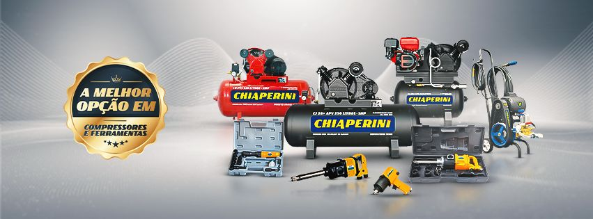

# Chiaperini Industrial

   
   

## Missão 🚀

Nosso compromisso é buscar continuamente o aperfeiçoamento da qualidade de nossos produtos e serviços, superando as expectativas de clientes, fornecedores e colaboradores.

## Visão 🔭

Almejamos ser uma das principais referências no mercado brasileiro de máquinas e ferramentas, fornecendo produtos e serviços reconhecidos pela qualidade, confiabilidade e comprometimento com nossos clientes.

## Valores 💼

- Valorização do ser humano, investindo em capacitação, desenvolvimento e qualificação das pessoas.
- Desenvolvimento de estratégias de negócios e normas internas baseadas no consenso, para garantir eficiência, transparência e sinergia.
- Condução dos negócios pautada na ética, respeito ao meio ambiente e cumprimento das leis.

## Sobre ℹ️

Fundada em 29 de abril de 1988, em Santa Rosa de Viterbo – SP, a Chiaperini é uma empresa líder no segmento de máquinas e ferramentas. Fabricamos uma ampla variedade de produtos, incluindo compressores de ar alternativos de pistão, compressores parafuso, motocompressores, lavadoras, ferramentas manuais e pneumáticas, atendendo ao diversificado mercado nacional.
